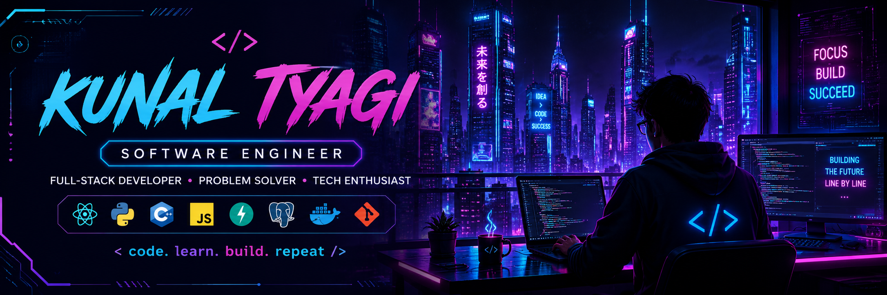

<p align="center">
  
</p>

<h1 align="center">Hi 👋, I'm Kunal Tyagi</h1>

<h3 align="center">
💻 Aspiring Software Engineer • Full-Stack Developer • Lifelong Learner
</h3>

<p align="center">
I enjoy building practical software, solving challenging problems, and continuously learning modern technologies.
</p>

---

## 🚀 About Me

```yaml
Name: Kunal Tyagi

Education:
  B.Tech in Computer Science & Engineering

Location:
  Greater Noida, Uttar Pradesh, India

Current Focus:
  • Full-Stack Development
  • Backend Engineering
  • Data Structures & Algorithms
  • System Design

Currently Learning:
  • React
  • FastAPI
  • PostgreSQL
  • Docker

Career Goal:
  Build scalable software and grow as a Software Engineer.

Quote:
  "Keep Learning. Keep Building."
```

---

## ⚡ Tech Stack

### 👨‍💻 Programming Languages

<p align="center">

</p>

### ⚛️ Frameworks & Libraries

<p align="center">

</p>

### 🗄️ Databases

<p align="center">

</p>

### 🛠️ Tools

<p align="center">

</p>

---

## 🚀 Featured Projects

### 📦 StockFlow

Inventory & Order Management System

**Tech Stack**

- React
- FastAPI
- PostgreSQL
- Docker

---

### 🎙️ Vocalytics

Speech Emotion Recognition & Mental Wellness Monitoring

**Tech Stack**

- Python
- Machine Learning
- Streamlit

---

### 📁 Mini File Compression Tool

Efficient lossless file compression using Huffman Coding.

**Tech Stack**

- C++

---

## 🌌 Current Goals

```text
✔ Build production-ready Full-Stack applications

✔ Strengthen Data Structures & Algorithms

✔ Contribute to Open Source

✔ Learn Cloud Technologies

✔ Secure a Software Engineering role
```

---

## 📊 GitHub Statistics

<p align="center">


</p>

<p align="center">


</p>

---

## 📬 Connect With Me

<p align="center">

<a href="https://github.com/kunalk077">

</a>

&nbsp;&nbsp;&nbsp;

<a href="https://www.linkedin.com/in/kunal-tyagi-589745258/">

</a>

&nbsp;&nbsp;&nbsp;

<a href="mailto:kunaltyagi190@gmail.com">

</a>

</p>

<p align="center">

📧 **kunaltyagi190@gmail.com**

</p>

---

<h3 align="center">

⚡ Code • Learn • Build • Improve ⚡

</h3>

<p align="center">

</p>
````
