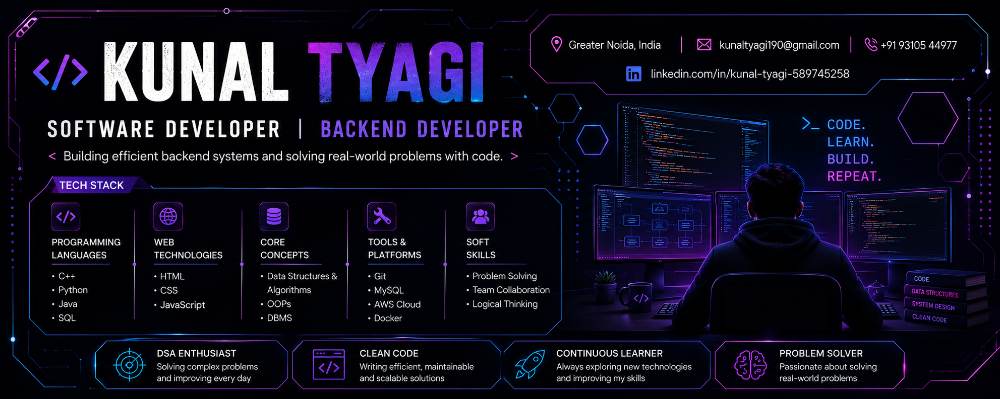

  

<h1 align="center">Hi 👋, I'm Kunal Tyagi</h1>

<h3 align="center">
💻 Software Developer | Backend Developer | DSA Enthusiast
</h3>

Passionate about building scalable backend applications, solving algorithmic problems, and writing clean, maintainable code.

---

## 👨‍💻 About Me

🎓 Final Year B.Tech Computer Science Engineering Student

💻 Aspiring Software Developer with a strong interest in Backend Development and Problem Solving.

🚀 I enjoy building practical software applications, improving my Data Structures & Algorithms skills, and learning modern backend technologies.

🎯 Currently preparing for Software Development Engineer (SDE) and Backend Developer roles.

---

# 🚀 Tech Stack

### 💻 Programming Languages

### ⚙ Backend Development

### 🌐 Web Technologies

### 🗄 Database

### ☁ Tools & Platforms

---

# 📚 Core Skills

- Data Structures & Algorithms
- Object-Oriented Programming
- Database Management Systems
- REST API Development
- Problem Solving
- Team Collaboration
- Logical Thinking

---

# 📌 Featured Projects

## 📦 StockFlow
Inventory Management System developed using React, Node.js, Express.js, MongoDB, Docker and GitHub.

---

## 🗜 Mini File Compression Tool

Implemented Huffman Coding in C++ for efficient lossless file compression and decompression.

---

## 📚 Bookshop Management System

Console-based inventory management application developed using C++ and File Handling concepts.

---

## 🎮 Tic Tac Toe

Responsive browser game built using HTML, CSS and JavaScript.

---

# 📊 GitHub Statistics

---

# 🌱 Currently Learning

- Advanced Data Structures & Algorithms
- Backend Development
- System Design Fundamentals
- Software Engineering Best Practices
- Cloud Technologies (AWS)

---

# 🎯 Career Objective

To build scalable software solutions, continuously improve my technical skills, and contribute as a Software Developer while solving real-world engineering problems.

---

# 📫 Connect with Me

---

## 💡 "Code • Learn • Build • Repeat"

⭐ Thanks for visiting my profile!

